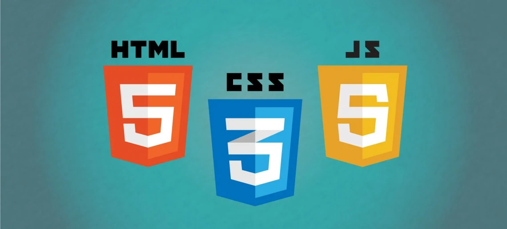

# VAWELS - DRAG AND DROP

This work was done as an exercise for the advanced Javascript course from Educacion It (Unit 4). 

## Used technologies: 

## Project objectives: 

- Create a game for childrens to practice vawels.
- Each object must be draged to a vawel considering first word of object.

## Main challenge:

- When game begins again, objects must be changed for others and they must appear in a different order. 
